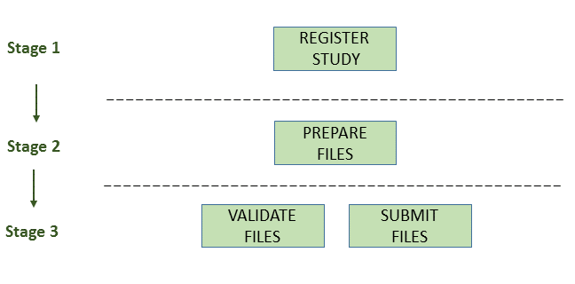

# Module 5: Annotated sequence flat file submissions

Currently supported through the [Webin programmatic submission interface](prog_12.html).

Planned to be supported in 2018 through the [Webin command line submission interface](cli_01.html).

<!---

## Introduction

Annotated sequence flat files can be submitted to the European Nucleotide Archive (ENA) 
using the [Webin command line submission interface](cli_01.html) 
with `-context sequence` option. 
 
An annotated sequence submission consists of:
- General sequence information
   - Study accession or unique name (alias)
   - Unique name for the submission
- Sequence flat files

The following picture illustrates the stages of the annotated sequence flat file submission process:



## Stage 1: Pre-register study

Each submission must be associated with a pre-registered study. The study  
accession or unique name (alias) is provided in an `info` file associated 
with the submission. 

Instructions for interactive submitters:
- [Register a Study](mod_02.html)

Instructions for programmatic submitters:
- [Register a Study](prog_02.html)

## Stage 2: Prepare the files

The set of files that are part of the submission are specified using a manifest file.
The manifest file is specified using the `-manifest <filename>` option.

An annotated sequence flat file submission consists of the following files:

- 1 manifest file
- 1 info file
- 1 flat file containing the sequences and functional annotation

### Manifest file

The manifest file has two columns separated by a tab (or any whitespace characters):
- File type (first column): case insensitive file type   
- File path (second column): the path to the file

The following case-insensitive file types are supported for annotated sequence flat file submissions:

- INFO: assembly info file
- FLATFILE: flat file containing the sequences and functional annotation 

For example, the following manifest file represents one submission:

```
INFO    sequences.info.gz
FLATFILE    sequences.dat.gz
``` 

### Info file

The info file is a text file (USASCII7) containing information common to all sequences.

The file has two columns separated by a tab (or any whitespace characters):
- Field name (first column)
- Field value (second column)

The following fields must be provided:
- STUDY: Study accession or unique name (alias)
- NAME: Unique name for the submission 

An example of an info file:

```
STUDY   TODO
NAME   TODO
```

## Stage 3: Validate and submit the files

Files are validated, uploaded and submitted using the [Webin command line submission interface](cli_01.html). 
Please refer to the [Webin command line submission interface](cli_01.html) documentation for more information 
about the submission process.

## Assigned accession numbers

Once the sequences have been submitted an analysis (ERZ) accession number is immediately assigned and 
returned to the submitter by the Webin command line submission interface. 

The purpose of the ERZ accession number is for the submitter to be able to refer to their submission within the 
Webin submission service. For example, the submitter can retrieve the assigned sequence accessions 
from the [Webin XML and reports portal](prog_11.html) or from the [Webin reports service](prog_10.html) using
the ERZ accession number.

For sequences, long term stable accession numbers that can be used in publications are:

- Study accession (PRJ) assigned at time of study registration.
- Sequence accession(s) assigned once the submission has been fully processed by ENA.

Submitters can retrieve the sequence accession numbers from the [Webin XML and reports portal](prog_11.html) 
or from the [Webin reports service](prog_10.html). These accession numbers are also send to the submitters by
e-mail.

-->
