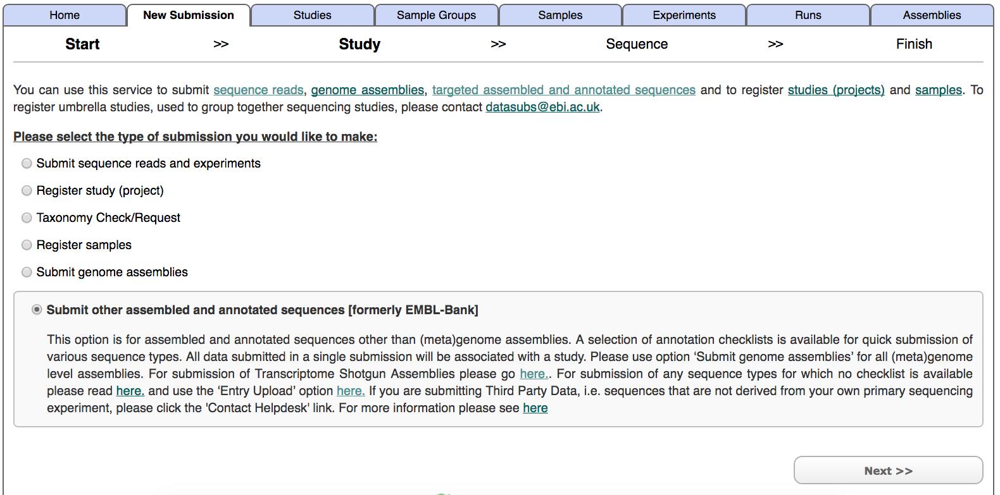
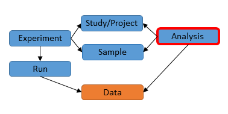

# Module 9: Submit Annotated Sequences

Annotated sequences can be submitted in tab separated files (TSV) format using Analysis XML.

Annotated sequences are assembled from shorter reads or sequenced using 
Sanger capillary sequencing. They can have features such as coding domains, introns and exons. 
Typical sequences are rRNA genes, single CDS genomic DNA sequences, MHC genes or mRNAs. Many other
types of sequences are supported as well.
 
Most submitters will use [Interactive Webin](https://www.ebi.ac.uk/ena/submit/sra/#submissions) 
to submit these types of sequences:



## Object relationships

Annotated sequence are submitted using Analysis XML and are required to be part of a study.



Studies are used to group other objects together and are typically used across multiple analyses and experiments.

## Accession numbers

The analysis XML will be assigned an ERZ accession at time of submission. However, this
accession is never used when citing the submission. Instead, refer to your data either using the
study accession (ERP or PRJ) or the assigned individual sequence accessions.

Each row in the submitted file corresponds to one sequence. Each sequence
will be assigned an individual sequence accession. The sequences from one
submission will share a contiguous range of sequece accession numbers. 

The sequence accessions will be assigned only when the submission has been fully
processed by ENA. This will happen some time after the submission has been made.
The sequence accessions will be send to you by e-mail and are also available 
through the [Webin XML and reports portal](prog_11.html). 

## Step 1: Register a study

If you have already registered a study then you can add your new analysis to it. If not then
you should register a new study:

- [Register a new study using interactive Webin](mod_02.html)
- [Register a new study using programmatic Webin](prog_02.html)

## Step 2: Create TSV file template

Sequences are submitted as a tab separated (TSV) file. 

Login into [Inteactive Webin](https://www.ebi.ac.uk/ena/submit/sra/#submissions), select
`Submit other assembled and annotated sequences` and download a tab separated (TSV) template. 


In the example below the sequence type is 'rRNA gene'. You can download the tab separated (TSV) template
by clicking the `Download Spreadsheet` button.


The downloaded file is called something like "Sequence-ERT000002-5697110325950293078.tsv". 

Take note of the ERT number which in this example is `ERT000002`. It represents the sequence type
('rRNA gene' in this case). This is required later when submitting the Analysis XML.

To fill in the TSV file you can use a spreadsheet editor. Each row in the file corresponds to a 
different sequence. The last column is for the sequence and the others are for annotation fields. 

## Step 3: Upload the TSV file

Please see [Data Upload](upload_01.html).

You must gz compress and upload the TSV file into your Webin upload area before you can
submit it using analysis XML. Once the analysis has been submitted the TSV file
will be moved from the Webin upload area into the archive.

## Step 4: Create the Analysis XML

The TSV file, now in your Webin upload area, is submitted using Analysis XML. 

The analysis object references a study and the compressed TSV file. 
It also includes the MD5 checksum for the compressed TSV file so that we can 
be sure that the file transfer has completed successfully.

Note that the analysis object also references the ERT number in the `FILE` block.

```xml
<ANALYSIS_SET>
   <ANALYSIS alias="ethylomonas">
      <TITLE>16S of Methylomonas sp.</TITLE>
      <DESCRIPTION>16S Methylomonas sp.</DESCRIPTION>
      <STUDY_REF accession="PRJEBxxxx">
      </STUDY_REF>
      <ANALYSIS_TYPE>
         <SEQUENCE_FLATFILE/>
      </ANALYSIS_TYPE>
      <FILES>
         <FILE checklist="ERT000002" checksum="5831463bb16a4c14374a0962d5a353cc" checksum_method="MD5" filename="ethylomonas.tsv.gz" filetype="tab"/>
      </FILES>
   </ANALYSIS>
</ANALYSIS_SET>
```
Remember that the above analysis XML is an example. You must provide your own details
in the analysis XML. 

## Create the Submission XML

To submit analyses, you need an accompanying submission XML in a separate file.
Let's call this file `submission.xml`. 

```
<SUBMISSION>
   <ACTIONS>
      <ACTION>
         <ADD/>
      </ACTION>
   </ACTIONS>
</SUBMISSION>
```

The submission XML declares one or more Webin submission service actions. 
In this case the action is `<ADD/>` which is used to submit new objects. 

The XMLs can be submitted programmatically, using CURL on command line or 
using the [Webin XML and reports portal](prog_11.html).

## Step 6: Submit the XMLs

### Submit the XMLs using CURL 

CURL is a Linux/Unix command line program which you can use to send the `analysis.xml` and `submission.xml`
to the Webin submission service.

```bash
curl -u username:password -F "SUBMISSION=@submission.xml" -F "ANALYSIS=@analysis.xml" "https://wwwdev.ebi.ac.uk/ena/submit/drop-box/submit/"
```

Please provide your Webin submission account credentials using the `username` and `password`.

After running the command above a receipt XML is returned. It will look like the one below:

```xml
<?xml version="1.0" encoding="UTF-8"?>
<?xml-stylesheet type="text/xsl" href="receipt.xsl"?>
<RECEIPT receiptDate="2017-05-05T15:28:38.557+01:00" submissionFile="submission.xml" success="true">
   <ANALYSIS accession="ERZ407913" alias="ethylomonas" status="PRIVATE" />
   <SUBMISSION accession="ERA907974" alias="ethylomonas" />
   <MESSAGES>
      <INFO>This submission is a TEST submission and will be discarded within 24 hours</INFO>
   </MESSAGES>
   <ACTIONS>ADD</ACTIONS>
</RECEIPT>
```

### Submit the XMLs using Webin XML and reports portal

XMLs can also be submitted interactively using the [Webin XML and reports portal](prog_11.html).
Please refer to the [Webin XML and reports portal](prog_11.html) document for an example how
to submit a study using XML. Other types of XMLs can be submitted using the same approach. 

### The Receipt XML

To know if the submission was successful look in the first line of the `<RECEIPT>` block. 

The attribute `success` will have value `true` or `false`. If the value 
is false then the submission did not succeed. In this case check the rest of 
the receipt for error messages and after making corrections, try the submission again. 

If the success attribute is true then the submission was successful. The receipt will 
contain the accession numbers of the objects that you have submitted.

### Test and production services

Note the message in the receipt:
```xml
<INFO>This submission is a TEST submission and will be discarded within 24 hours</INFO>
```

It is advisable to first test your submissions using the Webin test service where changes are not permanent 
and are erased every 24 hours. 

Once you are happy with the result of the submission you can use the CURL command again 
but this time using the production service. Simply change the part in the URL from `wwwdev.ebi.ac.uk` to 
`www.ebi.ac.uk`:

```bash
curl -u username:password -F "SUBMISSION=@submission.xml" -F "ANALYSIS=@analysis.xml" "https://www.ebi.ac.uk/ena/submit/drop-box/submit/"
```

Similarly, if you are using the [Webin XML and reports portal](prog_11.html) change the URL from 
`wwwdev.ebi.ac.uk` to `www.ebi.ac.uk`.
