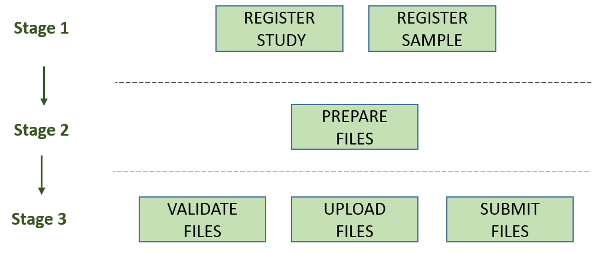

# Module 12: Genome Assembly Submissions

Genome assemblies including metagenomes can be submitted to the European Nucleotide Archive (ENA) 
using the [ENA validator](tool_01.md) command line program. 

Genome assembly submissions include plasmids, organelles, 
complete virus genomes, viral segments/replicons, bacteriophages, 
prokaryotic or eukaryotic genomes.
 
A genome assembly consists of:

- General assembly information
   - Study reference
   - Sample reference
   - Assembly name
   - TODO
- Contig sequences
- Scaffold sequences
- Chromosome sequences
- Unlocalised sequences
- Functional annotation (optional)

Chromosomes include organelles (e.g. mitochondrion and chloroplast), plasmids and viral segments/replicons.

## Introduction

The following picture illustrates the stages of the genome assembly submission process:

---    

---

## Stage 1: Register study and sample

Each submission must be associated with a study and a sample. 
Both must be pre-reqistered before the submission can be validated.

Please note that genome assemblies except metagenomes must be uniquely identified 
by a study and a sample.

### Register the study
 
To register one or more studies please follow either the interactive or programmatic study submission guidelines. 

### Register the sample
  
To register one or more samples please follow the interactive or programmatic sample submission guidelines.

## Stage 2: Prepare the files

A genome assembly submission consists of the following files:

- 1 manifest file
- 1 assembly info file
- 0-1 fasta files
- 0-1 AGP files
- 0-1 flat files
- 0-1 chromosome list file
- 0-1 unlocalised list file

All sequences must be identified by a unique name that is provided in the fasta, AGP or flat files.

It is essential that the sequence names are unique and used consistently between files. For example, the 
chromosome list file must refer to the chromosome sequences being submitted in Fasta, AGP or flat files 
using the unique name. Similarly, an AGP file must refer to scaffolds or contigs using the unique names.

### Manifest file

TODO

### Assembly info file

TODO

### Fasta file

Unannotated sequences should be submitted as a Fasta file.

The sequence name is extracted from the fasta header. For example the following sequence has name 'contig1':

`>contig1`

### AGP file

Scaffolds or chromosomes can be described using an AGP. For more information about the AGP file format refer to the 
[AGP 2.0 specification](https://www.ncbi.nlm.nih.gov/assembly/agp/AGP_Specification/).

### Flat file	

Annotated sequences must be submitted as an EMBL-Bank flat file.

The entry name is extracted from the AC * line . The entry name must be prefixed with a '_'.
For example the following sequence has name 'contig1':

`AC * _contig1`

### Chromosome list file

This file must be provided when the submission includes assembled chromosomes. 

The chromosome list file is a tab separated text file (USASCII7) containing the following columns:

- OBJECT_NAME (first column): The unique sequence name.
- CHROMOSOME_NAME (second column): The chromosome name. The value will appear as the /chromosome, /plasmid or /segment qualifiers in the EMBL-Bank flat files.
- CHROMOSOME_TYPE (third column):
    - chromosome
    - plasmid
    - linkage_group
    - monopartite
    - segmented
    - multipartite  
- CHROMOSOME_LOCATION (optional fourth column). By default eukaryotic chromosomes will be assumed to reside in the nucleus 
and procaryotic chromosomes and plasmids in the cytoplasm.
    - Macronuclear
    - Nucleomorph
    - Mitochondrion
    - Kinetoplast
    - Chloroplast
    - Chromoplast
    - Plastid
    - Virion
    - Phage
    - Proviral
    - Prophage
    - Viroid
    - Cyanelle
    - Apicoplast
    - Leucoplast
    - Proplastid
    - Hydrogenosome
    - Chromatophore

An example chromosome list file:

```
chr01 I Chromosome
chr02 II Chromosome
chr03 III	Chromosome
chr04	IV	Chromosome
```   
    
### Unlocalised list file

This file should be provided when the submission includes chromosomes with unlocalised sequences.

Unlocalised sequences are contigs or scaffolds that are associated with a specific chromosome but 
their order and orientation is unknown. 

The unlocalised list file is a tab separated text file (USASCII7) containing the following columns: 

- OBJECT_NAME: the unique sequence name.
- CHROMOSOME_NAME: the unique chromosome name associated with this sequence.

An example unlocalised list file:

```
cb25.NA_084     III
cb25.NA_093     III
cb25.NA_108     III
```   

## Stage 3: Validate and submit the files

Files are validated, uploaded and submitted using the [ENA validator](tool_01.md). 
