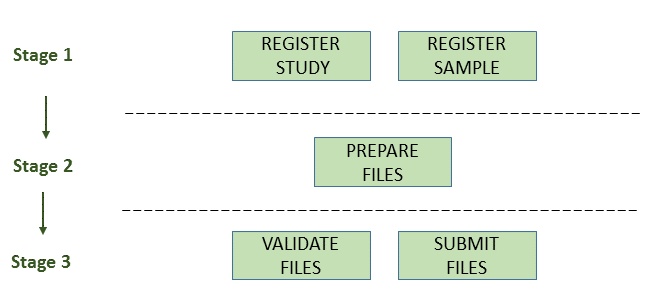

# Module 13: Transcriptome Assembly Submissions

## Introduction

Transcriptome assemblies can be submitted to the European Nucleotide Archive (ENA) 
using the [Webin command line submission interface](tool_01.md). 
 
A transcriptome assembly consists of:
- General assembly information
   - Study accession or unique name (alias)
   - Sample accession or unique name (alias)
   - Assembly program
   - Sequencing platform
   - Minimum gap length
   - Molecule type (genomic DNA)
   - Coverage
- Contig sequences (if any)
- Scaffold sequences (if any)
- Chromosome sequences (if any)
- Unlocalised sequences (if any)
- Functional annotation (optional)

Chromosomes include organelles (e.g. mitochondrion and chloroplast), plasmids and viral segments.

## Introduction

The following picture illustrates the stages of the genome assembly submission process:

---    

---

## Stage 1: Pre-register study and sample

Each submission must be associated with a pre-registered study and a sample. The study and sample 
accessions or unique names (aliases) are provided in an `info` file associated with the submission. 

Genome assemblies except metagenomes are uniquely identified by a study and a sample. When assemblies
are updated they must be re-submitted with the same study and sample as in the original submission.

## Stage 2: Prepare the files

The set of files that are part of the submission are specified using a manifest file.
The manifest file is specified using the `-manifest=<filename>` option.

A genome assembly submission consists of the following files:

- 1 manifest file
- 1 assembly info file
- 0-1 fasta files
- 0-1 AGP files
- 0-1 flat files
- 0-1 chromosome list file
- 0-1 unlocalised list file

### Sequence names

Sequences must have a unique name that is provided in the fasta, AGP or flat files. 
It is essential that the sequence names are unique and used consistently between files. 

For example, the chromosome list file must refer to the chromosome sequences using the unique names. 
Similarly, an AGP file must refer to scaffolds or contigs using the unique names.

### Manifest file

The manifest file has two columns separated by a colon (or a tab):
- File type: case insensitive file type.   
- File path: the path to the file.

For example, the following manifest file represents a genome assembly consisting of an info file 
and a fasta file:

```
INFO:genome.info.gz
FASTA:genome.fasta.gz
``` 

The following case-insensitive file types are supported for genome assemblies:

- INFO: assembly info file
- FASTA: sequences in fasta format.
- FLATFILE: sequences in EMBL-Bank flat file format. 
- AGP: Sequences in [AGP](https://www.ncbi.nlm.nih.gov/assembly/agp/AGP_Specification/) format.
- CHROMOSOME_LIST: list of chromosomes.
- UNLOCALISED_LIST: list of unlocalised sequences.

### Assembly info file

The assembly info file is a text file (USASCII7) containing general assembly information.

The file has two columns separated by a colon:
- Field name
- Field value

The following fields must be provided:
- STUDY: Study accession or unique name (alias) 
- SAMPLE: Sample accession or unique name (alias)
- ASSEMBLYNAME: The unique assembly name.
- PROGRAM: The assembly program.
- PLATFORM: The sequencing platform.

An example of an assembly info file:

```
STUDY:TODO
SAMPLE:TODO
ASSEMBLYNAME:TODO
PROGRAM:TODO
PLATFORM:TODO
```

### Fasta file

Unannotated sequences should be submitted as a Fasta file.

The sequence name is extracted from the fasta header. For example the following header 
contains the name 'contig1':

`>contig1`

### Flat file	

Annotated sequences must be submitted using an EMBL-Bank flat file.

The sequence name is extracted from the AC * line and must be prefixed with a '_'.
For example the following AC * line defines name 'contig1':

`AC * _contig1`

## Stage 3: Validate and submit the files

Files are validated, uploaded and submitted using the [Webin command line submission interface](tool_01.md). 
Please refer to the [Webin command line submission interface](tool_01.md) documentation for more information 
about the submission process.

## Validation rules

### Sequence validation rules

Sequences must:
- have unique names within an assembly
- be at least  200bp long
- not have terminal Ns
- consist of bases: 'a','c','g','t','u','b','d','h','k','m','n','r','s','v','w','y'
