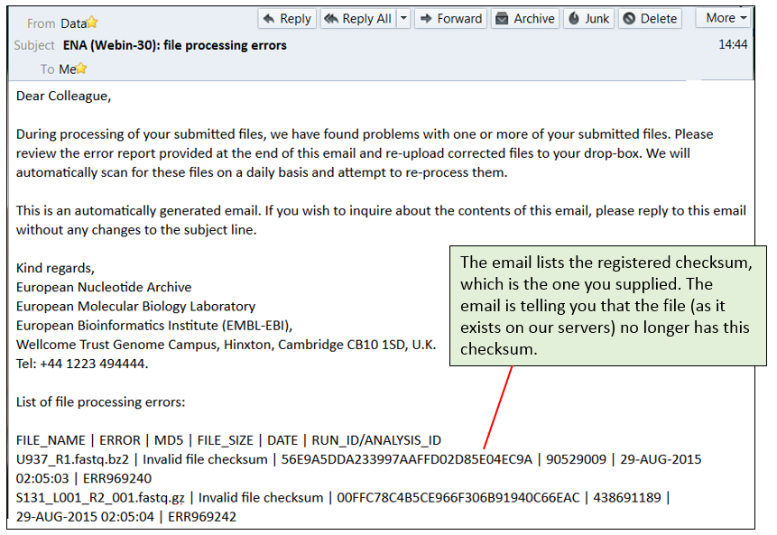
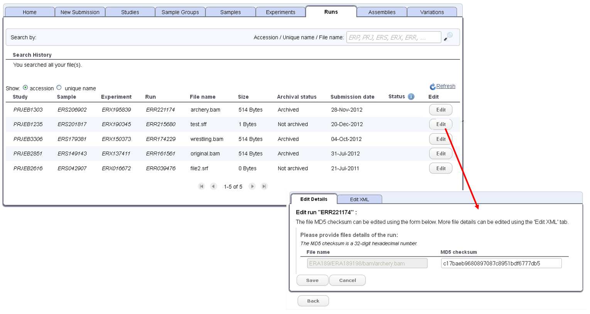
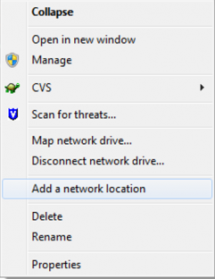
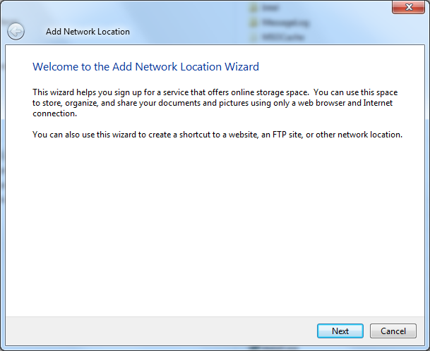
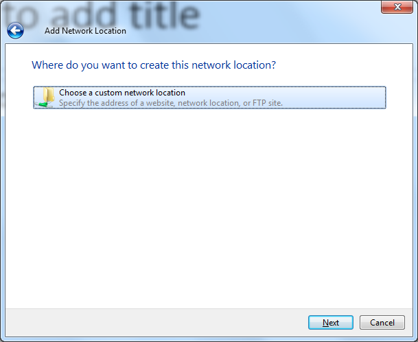
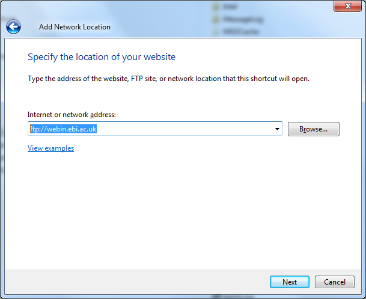
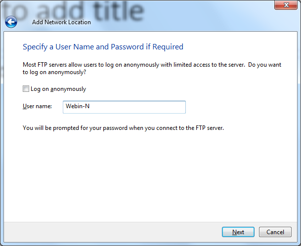
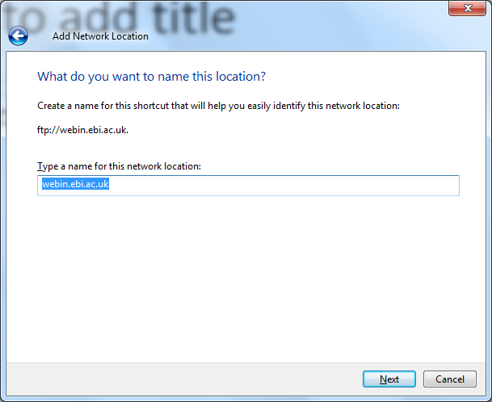
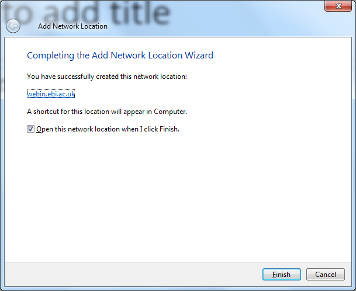
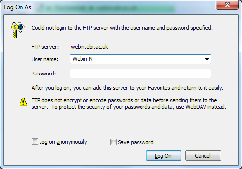

# Upload data files

Data files must be uploaded into a submitter specific private Webin file upload area
at EMBL-EBI before the files can be submitted using one of the Webin submission services. 

Note that if you are using the [Webin command line submission interface](cli_01.html)
then the data files will be uploaded and submitted by the application for you.

## Local copies of uploaded files

Always keep a local copy of the uploaded files until the files have been successfully 
submitted and archived. The Webin file upload area is a temporary transit area which is not backed 
up and any files residing on the area are subject to our fair use policy (see below).

## Fair use policy

ENA is a permanent and comprehensive data repository for public domain sequence and 
associated information. Data submitted into this system are routed transiently through
users` private data upload areas until such time as a submission instruction from the user, 
through his/her use of the Webin system, leads to the validation of the data and the movement 
of files from the data upload area into the ENA.

The data upload areas are provided as a temporary place in which data are held while in transit. 
As such, they are neither intended nor suitable for any longer-term storage of data. Such storage 
is provided in ENA itself. Once in ENA, data can be released immediately following submission or 
can be held confidential prior to analysis and literature publication if required.

We expect any given data file to remain in a data upload area for no longer than 2 months before
the instruction is given by the user to submit the file. While we attempt to remind users of this
policy at the 2 months time point we reserve the right to routinely delete any data files that 
persist in them for more than 2 months.

We place no absolute limit within the 2-month period on the total volume of user data that may 
exist in a data upload area at any one time and are keen to accommodate the largest submissions
where possible. However, we strongly encourage continuous data submissions where files are 
uploaded and submitted in small patches of few Terabytes or less and expect that volumes would 
not exceed 10 Terabytes under normal circumstances. Users who expect to deviate from this pattern
of usage are encouraged to contact us through datasubs@ebi.ac.uk at the earliest opportunity. 
Unexpected heavy use of the data upload areas may have an impact on other Webin users and we
are grateful for users` attention to this aspect of our fair use policy.

## File MD5 checksums

File transfers do not always complete successfully for large files. 

An MD5 checksum can be computed for a file before and after transfer 
to verify that the file was transmitted successfully.

You must provide an MD5 checksum for each file submitted to the archive. Webin will re-compute and verify the 
MD5 checksum to make sure that the file transfer was completed without any changes to the file contents.

To compute the checksum for a file in Linux or Mac you can use the `md5sum` command line program, for example:

```
md5sum a.fastq.gz
```

produces the following output containing the MD5 checksum for the file a.fastq.gz:

``` 
b26854779ea34e0bc3f47219e6e079e6 a.fastq.gz
```

There are several ways to provide a file MD5 checksum to Webin:

1. If you are using the [Webin command line submission interface](cli_01.html)
then the MD5 checksum will be computed automatically for each submitted file. 
2. Likewise, if you are using the [Webin File Uploader](http://www.ebi.ac.uk/ena/upload/WebinUploader.jnlp)
then the MD5 checksum will be computed automatically and stored in a MD5 checksum file. 
3. If you are using the [Interactive Webin](https://www.ebi.ac.uk/ena/submit/sra/) you can provide
the MD5 checksum as part of the submission spreadsheet for each file.
4. You can upload the MD5 checksum in a separate file. This MD5 checksum file must have the same name
as the uploaded data file except witha `.md5` suffix at the end. 

In Linux or Mac the MD5 checksum file can be created by using the `md5sum` command line program, for example:

```
> md5sum a.fastq.gz > a.fastq.gz.md5
``` 

produces `a.fastq.gz.md5` file with MD5 checksum and the file name:

``` 
b26854779ea34e0bc3f47219e6e079e6 a.fastq.gz
```

### File MD5 checksum does not match

If Webin detects a file with a MD5 checksum different from the one provided at time of submissions
then you will receive an e-mail notification:



Two possible reasons behind this error are:

1. Wrong MD5 checksum

You can check if you accidentally provided a wrong MD5 checksum by computing the checksum for your
local copy of the uploaded file and comparing this to the one provided in the email. If a wrong MD5 
checksum was indeed provided then you can upload a new MD5 checksum file or change the MD5 checksum 
using [Interactive Webin](https://www.ebi.ac.uk/ena/submit/sra/)



2. File was changed during transfer

If you know that the MD5 checksum provided at time of submission was correct then the file transfer 
was not successfully completed. In this case please upload the file again exactly in the same location
and with exactly the same name as before.  

### File content is invalid

There is an additional situation when you are expected to upload your file again.
 
Many submitted file formats are subjected to a format check. Any files that do not pass
this validation are required to be replaced before the file is accepted into the permanent archive.

For example, Webin insists that each submitted BAM file must be readable by [Samtools](http://www.htslib.org/). 
If this is not the case then please correct the file contents and upload the file again exactly in the same
location and with exactly the same name as before. Note that a new MD5 checksum must be provided for
the updated file.

## Upload files

Files are uploaded to the private Webin file upload area using the FTP or Aspera protocol through
the `webin.ebi.ac.uk` service. Please authenticate using your Webin submission
account name and password.


### General instructions for uploading files using a FTP client

1. Use your favourite ftp client. For example, `lftp` is a popular choice for 
linux and Mac users.
2. Use `binary mode` for file transfers.
3. Use `webin.ebi.ac.uk` as the target host.
4. `Login` with your Webin username and password.
5. `Upload` files to your private Webin upload area.

#### Ftp command line client on Linux/Mac

1. Open a terminal and type `ftp webin.ebi.ac.uk`.
2. Enter the username and password  associated with your Webin submission account.
3. Type bin to use binary mode.
4. Type `ls` command to check the content of your drop box.
5. Type `prompt` to switch off confirmation for each file uploaded.
6. Use `mput` command to upload files.
7. Use `bye` command to exit the ftp client.

#### Ftp command line client on Windows

1. Use FTP command line client on Windows
2. Start the command line interpreter: press Win-R, type cmd, hit enter
3. Type `ftp`
4. Type `open webin.ebi.ac.uk`
5. Enter the username and password associated with your Webin submission account.
6. Type bin to use binary mode.
7. Type `ls` command to check the content of your drop box.
8. Type `prompt` to switch off confirmation for each file uploaded.
9. Use `mput` command to upload files.
10. Use `bye` command to exit the ftp client.
11. Use `exit` command to exit the command line interpreter.

#### FileZilla client on Windows 

1. Download and install [FileZilla](https://filezilla-project.org/). If you are not administrator of your computer
then download the portable version of FileZilla.
2. Use the binary mode: `Transfer menu -> Transfer Type -> Binary`.
3. Use `webin.ebi.ac.uk` as the host.
4. Use your Webin username and password. 
5. Click `Quickconnect`.
6. Search for the file(s) you want to upload using the tree on the left panel.
7. Create directories in your drop box (if necessary) using the tree on the right panel.
8. Drag and drop the files you want to upload from the lower left panel to the lower right panel.
9. Once your transfer is successful, close the application.

### Aspera ascp command line program

Aspera is a commercial file transfer protocol that may provide better transfer speeds than
FTP over long distances. For short distance file transfers we recommend the use of FTP.

Download Aspera ascp command line client from [here](http://downloads.asperasoft.com/connect2/). 

Please select the correct operating system. The ascp command line client is distributed as part of 
the aspera connect high-performance transfer browser plug-in.

Your command should look similar to this:

```
ascp -QT -l300M -L- <file(s)> <Webin-N>@webin.ebi.ac.uk:.
 ```

The `-l300M` option sets the upload speed limit to 30MB/s. You may wish to lower this value to 
increase the reliability of the transfer.

The `-L-` option is for printing logs out while transferring,

The `<file(s)>` can be a file mask (e.g. `*.cram`), a list of files or a single file.

The `<Webin-N>` is your Webin submission account name.

### Webin File Uploader

Files can be uploaded using the Webin File Uploader, a Java web start application 
downloadable from [Interactive Webin](https://www.ebi.ac.uk/ena/submit/sra/) which 

1. [Download the Webin File Uploader](http://www.ebi.ac.uk/ena/upload/WebinUploader.jnlp)  
2. Launch the application. See further instructions for Mac users below.

3. Enter your Webin use r name in the `Username` field.
4. Enter your Webin password in the `Password` field. 
5. Browse into the local `Upload Directory` containing the data files you wish to upload using the `...` button. 
The list of all the files contained in the selected directory will be displayed.
6. Choose `Override` option if you wish to replace any existing files which have been previously uploaded.
7. Choose `Upload Tree` option if you wish to preserve the directory structure when uploading
files to the Webin upload area. By default, the files will be uploaded into the root directory 
of your Webin upload area.
8. Select the files to upload. You can use the `Select All` button to select all the files for upload.
9. Click on the `Upload` button.

#### Instructions to Mac users

When downloading the application the following dialog box will be displayed: 


Select the `Save File` option to save the WebinUploader.jnlp file to your local download directory.

If you selected the `Open with` option instead of the `Save File` option then the following dialog box 
will be displayed:


In this case please select `OK`. This will save the WebinUploader.jnlp file to your default
local download directory.

In order to run the File Uploader application, open your file explorer and go to the directory 
where the WebinUploader.jnlp file has been saved.

While pressing the `ctrl` button, select the WebinUploader.jnlp file then select the `open` option. 

The following dialog will now be displayed:


Now select the `Open` button. This will launch the the Webin File Uploader application.

### Windows 7 Explorer 

1. Right click `Computer` and select `Add a network location` from the menu



Click `Next`



Select `Choose a custom network location` and click `Next`



Type ftp://webin.ebi.ac.uk in the `Internet or netword address` field and click `Next`



Unselect `Log on anonymously`, type your Webin user name in the `User name` field and click `Next`



Type a network location to show in Windows Explorer e.g. `webin.ebi.ac.uk` click `Next`



Click `Finish` 



When using the new folder you will prompted for your Webin password. Type your password and click `Log on`


